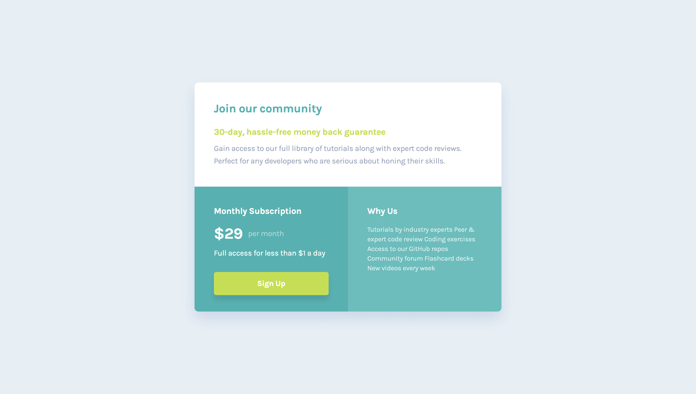

## Table of contents

- [Overview](#overview)
  - [Screenshot](#screenshot)
  - [Links](#links)
- [My process](#my-process)
  - [Built with](#built-with)
  - [What I learned](#what-i-learned)
- [Author](#author)

## Overview

### Screenshot

### Links

- Solution URL: [https://github.com/MuharemagiC/single-price-grid-component](https://github.com/MuharemagiC/single-price-grid-component)
- Live Site URL: [https://muharemagic.github.io/single-price-grid-component/](https://muharemagic.github.io/single-price-grid-component/)

## My process

### Built with

- CSS custom properties
- Flexbox
- Grid
- Mobile-first workflow

### What I learned

In this project I improved my css and html

### Continued development

For the future I want to improve my TypeScript, CSS and React skills. After it I will start learning new skills lik NextJS, GraphQL, NodeJS and more...

## Author

- Frontend Mentor - [@MuharemagiC](https://www.frontendmentor.io/profile/MuharemagiC)
